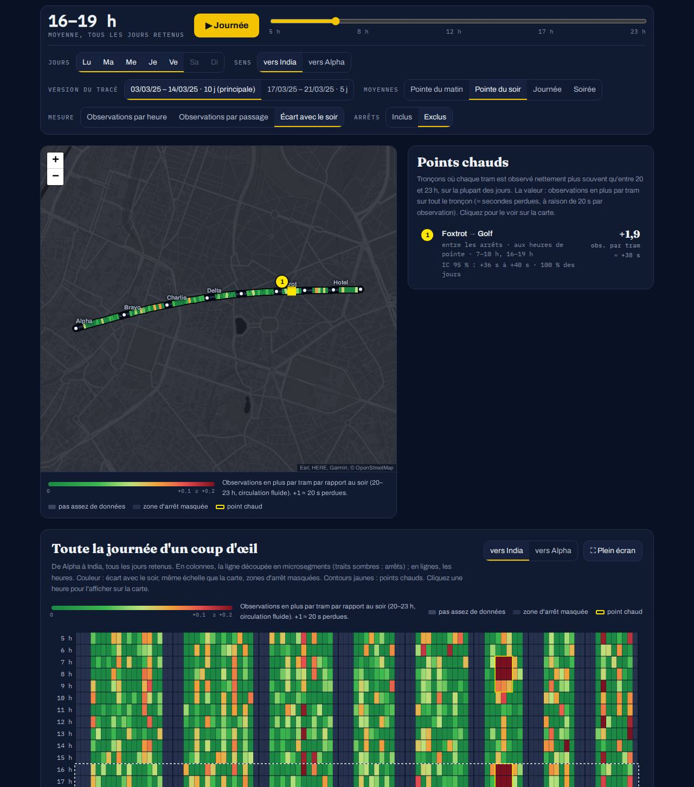

# microsegments

Where do buses and trams linger? `microsegments` cuts each line into short stretches (30 m by default)
and counts how many times a vehicle position is observed in each one, per hour and per day of the week.
It works with GTFS plus any vehicle position feed: GTFS-RT VehiclePositions (lat/lon, as CSV, parquet or
`.pb`) or linear-referenced AVL (last stop + distance, like STIB).



## Install

```bash
pip install "microsegments[plot]"        # plot extra = matplotlib
```

Python ≥ 3.11. Core dependencies: polars, numpy, shapely, gtfs-parquet (no pandas).

## Quick start (offline, synthetic data)

```bash
python examples/make_synth.py                     # simulated tram line S1 -> examples/data/
microsegments run examples/synth.toml -o out/     # result.parquet, analysis.json, report.html, matrix_dir*.png
```

## Linear-referenced feeds (STIB vehicle-distance)

```toml
[input]
paths = ["vd55/*.parquet"]           # <YYYYMMDD>.parquet (ts, dir, point, dist) + <YYYYMMDD>.snaps.parquet
kind = "stib"                        # or "linear" for any "stop_id + dist_m" table (map columns below)
events = "punctuality/*.parquet"     # optional stop events: passages from both sources, max taken

[input.linear]
id_normaliser = "leading_digits"     # "05766" -> "5766"
feed_length = "auto"                 # rescale feed metres to GTFS link lengths

[gtfs]
path = "gtfs/"                       # zip, .txt directory or gtfs-parquet directory
# dated = "gtfs/{date}"              # one feed per day instead

[select]
route = "55"
dates = "2025-02-17..2025-05-16"
weekdays = [0, 1, 2, 3, 4]
```

See `examples/stib55.toml` (runs on the two-day test fixture).

## GTFS-RT positions as CSV (lat/lon)

```toml
[input]
paths = ["positions/*.csv"]
kind = "latlon"
ts_unit = "s"                        # "s" | "ms" | "us" | "iso"
[input.columns]                      # canonical name = your column
ts = "timestamp"
route_id = "route_id"
vehicle_id = "vehicle_id"
lat = "latitude"
lon = "longitude"
trip_id = "trip_id"                  # optional, helps map matching
```

Per-vehicle fixes are thinned to one per `tick_s` (20 s) so counts stay comparable with a snapshot feed.
See `examples/gtfsrt_csv.toml` for every option.

## Python

```python
import microsegments as ms

res = ms.run(ms.Config.from_toml("ms.toml"))   # obs -> coverage -> network -> place -> passages
                                                # -> segments -> count -> analyse -> hotspots
res.result            # polars: one row per segment x hour (bands as hour -1 am, -2 pm, -3 day, -4 evening)
res.hotspots          # ranked stretches
ms.export(res, "report.html", lang="fr")       # standalone page (fr / en)
ms.plot.matrix(res, direction_id=0, metric="obs_per_h", days=[0, 1, 2, 3, 4], stops=False)
ms.plot.map(res, 0, "pm", metric="excess_per_passage")
contract = res.contract()                      # the page JSON (also the platform's /api/analysis)

pre = ms.prepare(cfg)                          # reuse placement to tune the segment length
tr = ms.tune.segment_length(pre.placed, pre.segment_fn(), coverage=pre.coverage, passages=pre.passages,
                            pattern_days=pre.network.pattern_days)
ms.plot.tune_curves(tr)
```

Stages are usable on their own: `read_observations`, `build_network`, `segment`, `count`, `analyse`,
`hotspots`, `simulate`.

## CLI

```bash
microsegments run CONFIG -o OUT [--lang en] [--segment-m 20] [--dates A..B] [--source "credit"]
microsegments tune CONFIG [--lengths 10,20,30,50] [--sensitivity] [-o OUT]
microsegments hotspots CONFIG [-o hotspots.geojson|.csv|.parquet]
microsegments inspect CONFIG        # coverage per day, GTFS versions, placement, evening vs line reference
microsegments compare CONFIG --a 2025-02-17..2025-03-31 --b 2025-04-01..2025-05-15 -o OUT
microsegments sensitivity-table CONFIG [CONFIG ...] -o OUT    # one tidy table + markdown over several lines
```

## What the numbers mean

Every poll (about every 20 s) puts each vehicle in one micro-segment: one **observation**. One observation
is therefore about 20 s of presence.

| Metric | Definition | Read as |
|---|---|---|
| `obs_per_h` (default) | Σ observations / Σ covered hours | vehicles seen in the segment per hour of polling; `/len × 10` for per 10 m |
| `obs_per_passage` | Σ observations / Σ passages | × 20 s ≈ time each vehicle spends there |
| `excess_per_passage` | obs per passage − the same at 20–23 h, same days | extra observations (≈ seconds / 20) lost per vehicle vs free-flowing evening |
| `excess_obs_per_h`, `log2_ratio` | see `metrics.py` | |

All values are ratios of sums over the selected days (optionally post-stratified by weekday). Stop zones
(30 m before to 60 m after each stop) can be masked to bring out signals and junctions. Colour scales are
fixed per metric (p98 over 6–21 h), so hours and weekdays compare directly.

## Missing data and GTFS versions

- **Hours** with < 80 % of polls, a frozen feed (> 5 min), the line absent, or abnormal vehicle counts are
  dropped from numerator and denominator. Polling gaps are handled by the exposure (covered hours); counts
  are never imputed.
- **Days** with more than 25 % of their 6–21 h dropped are excluded and listed with the reason
  (`res.analysis.excluded_days`, coverage calendar in the page).
- **GTFS changes**: patterns are rebuilt per service date; `link_key` / `seg_key` are stable across
  versions. Each segment is aggregated only over the days it belongs to the day's main pattern (the
  reference too). The page shows the most frequent version; others are selectable. A single feed whose
  calendar does not cover some dates lends them the patterns of the same weekday.

## Choosing the segment length

`microsegments tune` scores L ∈ {10, 15, 20, 30, 40, 50, 75, 100} m (leave-one-day-out Poisson deviance,
split-half reliability, hotspot localisation spread and Jaccard) and picks the smallest L with reliability
≥ 0.8, spread ≤ 30 m and deviance within one standard error of the minimum. 30 m is a good default for
20 s polling at urban speeds; go shorter only with dense GTFS-RT fixes and many days. `--sensitivity`
re-runs phase offsets, gap caps (30, 40, 60, ∞ s), stop zones, references, passage sources and segment
lengths 15 / 30 / 60 m around the baseline.

## Hotspots

Stretches where the excess over the evening has a 95 % bootstrap lower bound above 2 s per vehicle, is
positive on ≥ 60 % of days, survives Benjamini–Hochberg (q = 0.1) and lasts ≥ 2 hours or a peak band.
Adjacent bins merge, never across a stop / running border. Classes: *infrastructure* (all day),
*congestion* (peak only), *mixed*. Needs at least 5 included days. Export as GeoJSON with
`microsegments hotspots CONFIG -o hotspots.geojson`.

## Comparing two periods

`microsegments compare` (or `ms.compare(analysis_a, analysis_b)`) compares observations per passage
segment by segment and hour by hour, each period with its own days and references, with a day bootstrap
of the difference. Segments are matched by key (or by stop pair when a new GTFS version moved the shape a
little); the others are listed and left out. Adjacent significant segments form stretches, ranked by the
change in vehicle time per day; stretches whose frequency changed by more than 20 % are flagged, since a
timetable change can explain part of the difference. The HTML page gets a "compare two periods" view.

## License

MIT. The bundled Leaflet CSS is BSD-2-Clause.
